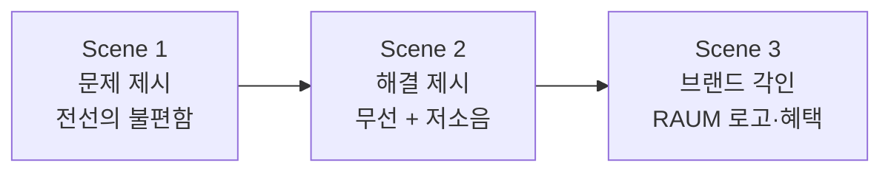
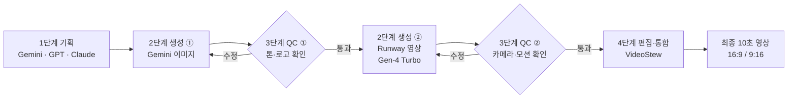
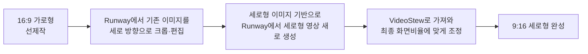
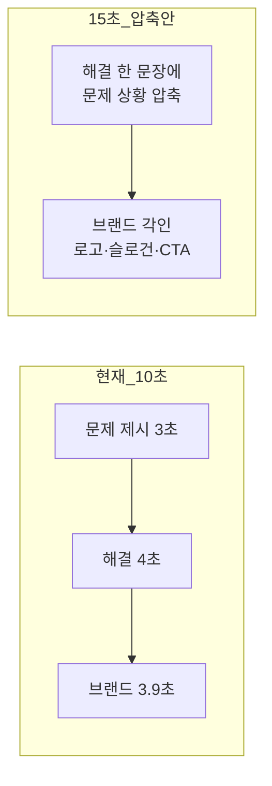

# RAUM(라움) — AI 기반 브랜드 광고 패키지 기획서

> **GenAI 기초 2 : 멀티모달 콘텐츠 제작 (AI-B1-2 과제)**
> 가상 브랜드 **RAUM(라움)** · 무선 저소음 헤어드라이기 · 10초 광고 영상 (16:9 / 9:16)

---

## 프로젝트 한눈에 보기

| 항목 | 내용 |
| --- | --- |
| 브랜드 / 제품 | **RAUM(라움)** / 무선 저소음 헤어드라이기 (가상 브랜드) |
| 타깃 | 20~30대 1인 가구·직장인 (아침이 바쁘고, 소음에 민감하며, 미니멀한 삶을 선호) |
| 핵심 메시지 | 무선의 자유와 저소음으로 아침을 더욱 편안하게 만든다 |
| 슬로건 / CTA | "선 없이, 더 조용하게." / "지금, RAUM을 만나보세요." |
| 결과물 | 10초 광고 영상 1편 (가로 16:9 + 세로 9:16, 총 2개 파일) |
| 스토리 구조 | 문제 제시 → 해결 → 브랜드 인식 (기승전결) |
| 제작 파이프라인 | 기획 → 생성 → 검수(QC) → 편집·통합 |
| 사용 AI 도구 | 기획 **Gemini / GPT / Claude** · 이미지 **Gemini** · 영상 **Runway (Gen-4 Turbo)** · 편집 **VideoStew** |

### 저장소 구성

| 파일 | 설명 |
| --- | --- |
| `README.md` | 본 기획서 |
| `RAUM_기획서_최종본.pdf` | 제출용 기획서 (PDF) |
| `B-2_최종편집영상_이혜경(가로).mp4` | 최종 영상 · 16:9 가로형 |
| `B-2_최종편집영상_이혜경(세로).mp4` | 최종 영상 · 9:16 세로형 |

---

## 목차

| 구분 | 장 |
| --- | --- |
| **기초** | [0. 용어정리](#0-용어정리) |
| **기획** | [1. 브랜드 기획](#1-브랜드-기획) · [2. AI 도구 활용 계획과 선정 이유](#2-ai-도구-활용-계획과-선정-이유) · [3. 스토리보드](#3-스토리보드) · [4. 프롬프트 수정 전후 기록](#4-프롬프트-수정-전후-기록) |
| **제작 조건** | [5. 제약사항 반영](#5-제약사항-반영) · [6. 최종 영상 파일 스펙](#6-최종-영상-파일-스펙) · [7. 과제 목표 및 기능 요구사항 반영](#7-과제-목표-및-기능-요구사항-반영) |
| **편집 설정** | [8. 나레이션 자막 대본](#8-나레이션-자막-대본) · [9. 배경음악과 전환효과](#9-배경음악과-전환효과) · [10. 화면비율 제작 프로세스](#10-화면비율-제작-프로세스) |
| **품질 관리** | [11. 에셋 규격과 생성 파라미터 표준화](#11-에셋-규격과-생성-파라미터-표준화) · [12. 결과 파일 네이밍 규칙](#12-결과-파일-네이밍-규칙) · [15. 불일치 보정 기준과 절차](#15-불일치-보정-기준과-절차) |
| **도구 선택** | [13. 이미지 생성 vs 영상 생성 도구 선택 기준](#13-이미지-생성-vs-영상-생성-도구-선택-기준) · [14. 도구 선택 우선순위](#14-도구-선택-우선순위) · [17. 다른 도구로 만들었다면](#17-다른-도구로-만들었다면) |
| **확장·대안** | [16. 확장 시나리오 60초 버전을 15초로 줄인다면](#16-확장-시나리오-60초-버전을-15초로-줄인다면) · [18. 크레딧 부족 시 대안 전략](#18-크레딧-부족-시-대안-전략) · [19. 기대 효과](#19-기대-효과) |
| **부록** | [참고 자료](#부록-참고-자료) |

---

## 0. 용어정리

> 광고·영상·생성형 AI가 처음인 분들을 위한 용어 사전입니다. 본문에서 모르는 단어가 나오면 이곳으로 돌아오세요.

### 0-1. 브랜드·마케팅 용어

| 용어 | 쉬운 설명 | 이 프로젝트에서는 |
| --- | --- | --- |
| **브랜드 (Brand)** | 제품·서비스를 다른 것과 구별해 주는 이름, 이미지, 약속의 묶음 | 가상 브랜드 RAUM(라움) |
| **타깃 (Target)** | 광고가 말을 거는 대상 고객 | 20~30대 1인 가구·직장인 |
| **USP** (Unique Selling Proposition) | "우리만의 차별점". 경쟁 제품과 다른 단 하나의 강점 | 무선의 자유 + 업계 최저 수준 저소음 |
| **핵심 메시지 (Key Message)** | 광고가 전달하려는 한 문장 | "무선의 자유와 저소음으로 아침을 더욱 편안하게" |
| **톤앤매너 (Tone & Manner)** | 광고 전체의 분위기와 말투, 색감의 일관된 방향 | 미니멀·프리미엄, 라벤더·화이트·실버 |
| **슬로건 (Slogan)** | 브랜드를 기억하게 하는 짧은 문구 | "선 없이, 더 조용하게." |
| **CTA** (Call To Action) | 보는 사람에게 다음 행동을 유도하는 문구 | "지금, RAUM을 만나보세요." |
| **로고 / 심볼** | 브랜드를 나타내는 그림·글자 마크 | 바람의 곡선 + 드라이기 실루엣 |
| **키비주얼 (Key Visual)** | 광고의 분위기를 대표하는 핵심 이미지 | Gemini로 만든 씬별 대표 이미지 |
| **히어로샷 (Hero Shot)** | 제품을 가장 멋지게 보여주는 대표 컷 | Scene 3의 충전 거치대 위 제품 컷 |
| **기승전결** | 이야기의 4단 구성(시작-전개-전환-마무리) | 문제 제시 → 해결 → 브랜드 인식 |

### 0-2. 영상·촬영·편집 용어

| 용어 | 쉬운 설명 |
| --- | --- |
| **스토리보드 (Storyboard)** | 영상의 장면 순서·구도·대사를 미리 정리한 설계도 |
| **씬 (Scene)** | 한 장소·한 흐름으로 이어지는 장면 단위 (이 프로젝트는 3개 씬) |
| **나레이션 (Narration)** | 화면 밖에서 들려주는 설명 음성 |
| **자막 (Subtitle)** | 화면에 표시되는 글자 |
| **BGM** (Background Music) | 배경음악 |
| **효과음 (SFX)** | 모터 소리, 전선 마찰음처럼 상황을 살리는 소리 |
| **페이드 인 / 아웃** | 소리·화면이 서서히 나타나거나 사라지는 효과 |
| **전환효과 (Transition)** | 장면과 장면 사이를 이어 주는 효과 (예: Auto 0.3s) |
| **트리밍 (Trimming)** | 영상의 앞뒤·중간을 잘라 길이를 줄이는 작업 |
| **통편집** | 따로 만든 여러 영상 조각을 하나로 이어 붙여 편집하는 일 |
| **렌더링 (Rendering)** | 편집 결과를 실제 영상 파일(mp4 등)로 출력하는 과정 |
| **카메라 워크 (Camera Work)** | 카메라의 움직임과 구도 연출 |
| **와이드 샷 (Wide Shot)** | 인물과 배경을 넓게 담는 샷 |
| **미디엄 샷 (Medium Shot)** | 인물의 상반신 정도를 담는 샷 |
| **클로즈업 (Close-up)** | 대상을 화면 가득 가깝게 담는 샷 |
| **매크로 클로즈업 (Macro)** | 아주 작은 부분(예: 노즐)까지 초근접해서 담는 샷 |
| **줌인 (Zoom-in)** | 렌즈를 조절해 대상을 점점 크게 보이게 하는 것 |
| **돌리인 / 돌리백 (Dolly-in / back)** | 카메라 자체가 대상 쪽으로 다가가거나 뒤로 물러나는 움직임 |
| **틸트 (Tilt)** | 카메라를 위아래로 꺾는 움직임 |
| **로우앵글 (Low-angle)** | 아래에서 위로 올려다보는 각도 (제품이 우아하고 커 보임) |
| **Ken Burns 효과** | 정지 이미지에 천천히 줌인·팬을 줘서 움직이는 느낌을 내는 기법 |
| **네거티브 스페이스 (Negative Space)** | 일부러 비워 둔 여백 (로고·슬로건을 올릴 자리) |
| **심도 (Depth of Field)** | 초점이 맞는 범위. "얕은 심도"는 주변이 흐려져 대상이 돋보임 |

### 0-3. 영상 규격 용어

| 용어 | 쉬운 설명 | 이 프로젝트 값 |
| --- | --- | --- |
| **화면비율 (Aspect Ratio)** | 화면의 가로:세로 비율 | 16:9(가로), 9:16(세로) |
| **16:9** | TV·유튜브 같은 가로형 표준 | 기본(선제작) 버전 |
| **9:16** | 릴스·쇼츠·틱톡 같은 세로형 | 파생 버전 |
| **해상도 (Resolution)** | 화면을 이루는 픽셀 수. 클수록 선명 | 1920x1080 (세로형 1080x1920), 저사양 시 720p 이상 |
| **fps** (Frames Per Second) | 1초에 보여 주는 장면(프레임) 수 | 24~30fps |
| **코덱 (Codec)** | 영상·음성을 압축·재생하는 방식 | 영상 H.264 / 오디오 AAC |
| **mp4** | 가장 널리 쓰이는 영상 파일 형식 | 최종 결과물 확장자 |

### 0-4. 생성형 AI 용어

| 용어 | 쉬운 설명 |
| --- | --- |
| **생성형 AI (GenAI)** | 글·이미지·영상·음성 등을 새로 만들어 내는 AI |
| **멀티모달 (Multimodal)** | 텍스트·이미지·영상·음성처럼 여러 형태의 정보를 함께 다루는 방식 |
| **프롬프트 (Prompt)** | AI에게 주는 지시문. 구체적일수록 결과가 원하는 방향에 가까워짐 |
| **Text-to-Image (T2I)** | 글로 설명해서 **이미지**를 만드는 방식 |
| **Image-to-Video (I2V)** | 이미 있는 **이미지**에 움직임을 더해 영상으로 만드는 방식 |
| **참조 이미지 (Reference Image)** | "이 이미지처럼 만들어 줘"라고 함께 넣는 기준 이미지 |
| **참조 이미지 체이닝** | 앞 씬에서 만든 이미지를 다음 씬 생성에 계속 넣어 인물·스타일을 이어 가는 방법 |
| **일관성 (Consistency)** | 씬이 바뀌어도 같은 인물·색감·로고가 유지되는 정도 |
| **재생성 (Regeneration)** | 결과가 마음에 들지 않아 프롬프트를 고쳐 다시 만드는 것 |
| **크레딧 (Credit)** | AI 서비스에서 생성·다운로드할 때 소모되는 사용 포인트 |
| **AI 보이스 / TTS** | 글을 사람 목소리처럼 읽어 주는 음성 합성 (Text-To-Speech) |
| **파이프라인 (Pipeline)** | 여러 작업을 순서대로 이어 놓은 제작 흐름 |
| **QC** (Quality Control) | 결과물이 기준에 맞는지 확인하는 검수 |
| **SynthID** | 구글이 AI 생성 이미지 등에 넣는 워터마크. 나중에 AI 생성물인지 식별하는 데 쓰임 |

### 0-5. 프롬프트에 자주 나오는 영어 표현

| 표현 | 뜻 |
| --- | --- |
| `photorealistic` | 사진처럼 사실적인 |
| `cinematic` | 영화 같은 분위기의 |
| `commercial photography` | 광고용 사진 스타일 |
| `wide shot` / `medium shot` / `close-up` | 와이드 샷 / 미디엄 샷 / 클로즈업 |
| `dolly in` / `dolly backward` | 카메라가 다가감 / 뒤로 물러남 |
| `low-angle` | 아래에서 올려다보는 각도 |
| `shallow depth of field` | 얕은 심도 (배경이 흐려짐) |
| `soft directional lighting` | 방향성이 있는 부드러운 조명 |
| `matte` | 광택 없는 무광 질감 |
| `negative space` | 비워 둔 여백 |
| `16:9 widescreen aspect ratio` | 16:9 가로 화면비율 |

### 0-6. 사용 도구 소개

| 도구 | 종류 | 한 줄 설명 | 이 프로젝트에서의 역할 |
| --- | --- | --- | --- |
| **Gemini** | 생성형 AI (텍스트·이미지) | 구글의 AI. 이미지 생성 모델은 텍스트와 참조 이미지를 함께 받아 이미지를 만들고 수정할 수 있으며, 이미지 속 글자(로고·포스터 문구)를 비교적 또렷하게 그려 내는 것이 특징 | 기획 보조 + 씬별 키비주얼·제품 히어로샷 생성 |
| **GPT** | 생성형 AI (텍스트) | OpenAI의 대화형 AI | 기획·내레이션 초안 작성 |
| **Claude** | 생성형 AI (텍스트) | Anthropic의 대화형 AI | 기획·스토리보드 문서화 |
| **Runway** | AI 영상 생성 서비스 | 브라우저에서 이미지를 영상으로 바꾸는 서비스. **Gen-4 Turbo**는 2025년 4월 공개된 Gen-4의 속도 중심 모델로, 이미지 + 모션 설명을 넣으면 짧은 영상을 빠르게 만들어 줌 | 정지 이미지 → 광고 영상 변환 |
| **VideoStew** | AI 영상 편집 서비스 | 파워포인트처럼 슬라이드 단위로 편집하는 온라인 영상 편집기. AI 음성(TTS)·BGM·자막을 한곳에서 처리 | 나레이션·자막·BGM·전환·최종 렌더링 |

**같이 알아 두면 좋은 (이번에는 사용하지 않은) 도구**

| 도구 | 설명 |
| --- | --- |
| **Midjourney** | 예술적 완성도가 높은 이미지 생성 서비스. 2025년 6월부터 "Animate" 기능으로 이미지→영상도 지원 |
| **Google Flow / Gemini Omni** | 구글의 AI 영상 제작 도구(Flow)와 텍스트·이미지·오디오·영상 입력을 받는 영상 모델(Omni, 2026년 5월 I/O 공개) |
| **CapCut** | 대중적인 영상 편집 앱 (이번 과제에서는 사용하지 않음) |
| **Pika / Kling** | Runway와 같은 계열의 이미지→영상 생성 서비스 (크레딧 부족 시 대안) |

---

## 1. 브랜드 기획

### 1-1. 브랜드 정의

| 항목 | 내용 |
| --- | --- |
| 브랜드명 | **RAUM(라움)** — 발음이 짧고 국내외 누구나 쉽게 읽을 수 있는 글로벌 지향 이름 |
| 제품 | 무선 저소음 헤어드라이기 |
| 타깃 | 20~30대 1인 가구·직장인 — 아침 시간이 촉박하고, 소음에 민감하며, 미니멀한 라이프스타일 선호 |
| **USP** | 무선의 자유로움 + 업계 최저 수준의 저소음 설계 → **"조용해서 더 편안한 아침"** |
| 톤앤매너 | 미니멀하고 프리미엄한 느낌 |
| 브랜드 컬러 | 라벤더 · 화이트 · 실버 (차분하고 세련된 색감) |
| 핵심 메시지 | "무선의 자유와 저소음으로 아침을 더욱 편안하게 만든다" |
| 슬로건 | "선 없이, 더 조용하게." |
| CTA | "지금, RAUM을 만나보세요." |

### 1-2. 로고 컨셉

| 항목 | 내용 |
| --- | --- |
| 형태 | 둥근 바람의 곡선 + 드라이기 실루엣을 결합한 미니멀 심볼 |
| 배색 | 화이트 · 라이트블루 · 실버 |
| 설계 의도 | 작은 화면에서도 잘 인지되도록 단순하게 설계 |

### 1-3. 기획 의도와 스토리라인

기존 유선 드라이기의 **전선 불편함과 소음 문제**를 짧고 강하게 제시한 뒤, RAUM의 **무선성과 저소음 기능으로 문제가 자연스럽게 해결되는 과정**을 10초 영상으로 전달합니다.



---

## 2. AI 도구 활용 계획과 선정 이유

용도별로 도구를 **하나씩 확정**했고, 별도의 대체 도구는 사용하지 않았습니다. 전체 작업은 **기획 → 생성 → 검수 → 편집·통합**의 4단계 파이프라인입니다.



### 2-1. 단계별 도구와 작업 방식

| 단계 | 도구 | 하는 일 | 작업 순서 |
| --- | --- | --- | --- |
| **1. 기획** (텍스트) | Gemini / GPT / Claude | 브랜드 콘셉트, 핵심 메시지, 스토리보드 문서화, 내레이션 초안 | 세 도구를 함께 활용 |
| **2-①. 생성** (이미지) | **Gemini** | 씬별 키비주얼·제품 히어로샷 생성. 이전 씬 이미지를 참조 이미지로 넣어 인물·스타일 일관성 유지, 브랜드명(RAUM)·로고를 이미지 안에 정확히 렌더링 | 프롬프트 입력 → 참조 이미지 첨부 → 생성 |
| **2-②. 생성** (영상) | **Runway** | 가입 시 받은 무료 크레딧으로 AI 이미지를 AI 영상으로 변환 | `[Custom]` → 이미지 업로드 → 준비한 프롬프트 입력 → 모델 `[Gen-4 Turbo]` → `[Generate]` |
| **3. 검수 (QC)** | 사람 검수 | 이미지·영상 결과물이 기준에 맞는지 확인 | 아래 3단계 표 참조 |
| **4. 편집·통합** | **VideoStew** | 검수 통과 소스만 업로드해 나레이션·자막·BGM·전환 편집 후 렌더링 | `[비주얼]→[사용자]` 탭에서 업로드 → 슬라이드에 추가 → 편집 → 렌더링·다운로드 (다운로드 시 크레딧 차감) |

### 2-2. 검수(QC) 4단계

| 순서 | 시점 | 확인 내용 | 기준 미달 시 |
| --- | --- | --- | --- |
| ① | Gemini 이미지 생성 직후 | 이미지 3장을 나란히 비교 — 인물·색감·로고 표기가 이전 씬과 어긋나지 않는지 | 프롬프트 수정 후 재생성 ([4장](#4-프롬프트-수정-전후-기록) 참조) |
| ② | Runway 영상 변환 직후 | 카메라 워크·모션이 의도한 톤과 맞는지 | 프롬프트 수정 후 재생성 |
| ③ | VideoStew 업로드 직전 | 세 씬의 해상도·화면비율·색감 일치 여부 | [15장](#15-불일치-보정-기준과-절차) 기준으로 보정 |
| ④ | 최종 렌더링 전 | 슬라이드 전환 지점에서 밝기·색감이 튀지 않는지 | 밝기·색온도 미세 조정 |

### 2-3. 편집 세팅 요약

| 항목 | 설정 |
| --- | --- |
| 나레이션 | AI 보이스 **'가현'** |
| 자막 폰트 | **'카페24 클래식타입'** |
| BGM | 2개 트랙을 슬라이드별로 분리 (Scene 1: NAVY CLOUD - feat. 사도 / Scene 2~3: 큐디드라이 - EDM) |
| 전환효과 | Auto |
| 편집 도구 | VideoStew 한 곳에서 전부 처리 (CapCut 미사용) |

### 2-4. 실제 작업 화면

> 📷 **[이미지 삽입 위치]** Runway 작업 화면 — `Custom → 이미지 업로드 → 프롬프트 입력 → Gen-4 Turbo → Generate` (영상 생성 진행률 75% 표시)
> <!--  -->

> 📷 **[이미지 삽입 위치]** VideoStew 작업 화면 — Scene 2 슬라이드 편집 중. 자막·나레이션 "선 없이 더욱 자유롭게, 조용하게." 배치, 재생시간 4초, 전환효과 Auto(0.3s) 설정 모습
> <!--  -->

---

## 3. 스토리보드

### 3-1. 전체 타임라인

Scene 1(3초) + Scene 2(4초) + Scene 3(3.9초)를 각각 개별 영상으로 만든 뒤, 전체를 시간 단축(트리밍)하여 **정확히 10초** 영상 한 편으로 통편집했습니다. 모든 씬의 **자막과 나레이션 문구는 동일**하게 통일했습니다 (별도의 압축형 자막은 삭제).

| Scene | 역할 | 개별 렌더링 | 나레이션 = 자막 | BGM | 톤 |
| --- | --- | --- | --- | --- | --- |
| **1** | 문제 제시 | 3초 | "바쁜 아침, 작은 불편함이 시작됩니다." | NAVY CLOUD - feat. 사도 | 긴장·불편 |
| **2** | 해결 제시 | 4초 | "선 없이 더욱 자유롭게, 조용하게." | 큐디드라이 - EDM | 편안·해방 |
| **3** | 브랜드 각인 | 3.9초 | "RAUM, 무선 저소음 헤어드라이기, 당신의 아침을 더 편안하게." | 큐디드라이 - EDM (유지) | 프리미엄·마무리 |

### 3-2. Scene 1 — 문제 제시 (개별 렌더링 3초)

| 항목 | 내용 |
| --- | --- |
| **목표 메시지** | "바쁜 아침, 선이 늘 걸리는 불편함"을 3초 안에 직관적으로 각인 |
| **화면 구성** | 모던한 화이트톤 욕실에서 젖은 머리를 말리려는 인물이 유선 드라이기를 사용. 짧고 팽팽하게 꼬인 검은 코드가 콘센트에서 억지로 당겨져 움직임을 제한하고, 불편함과 짜증이 표정·자세에서 드러남 |
| **카메라 워크** | 와이드 샷에서 시작 → 서서히 줌인해 손잡이에 감긴 전선과 초조한 표정을 담음 → 마지막에 세면대 모서리에 걸린 전선을 타이트하게 클로즈업 |
| **나레이션 = 자막** | "바쁜 아침, 작은 불편함이 시작됩니다." |
| **배경음악·효과음** | NAVY CLOUD - feat. 사도 (볼륨 40%, 페이드인) + 드라이기 모터 소음 + 전선 마찰 효과음 |
| **사용 도구 흐름** | Gemini(키비주얼) → Runway(Custom · Gen-4 Turbo 모션 변환) → VideoStew(나레이션 '가현', 자막·BGM 삽입, 전환 Auto, 3초 렌더링) |
| **출력 결과 요약** | 인물의 표정과 엉킨 전선이 3초 안에 각인되고, 다음 씬과 명확히 대비되는 긴장된 톤 확보. 화면·나레이션·자막에 목표 메시지가 일관되게 반영됨 |

> 📷 **[이미지 삽입 위치]** Scene 1 키비주얼 <!--  -->

<details>
<summary><b>Scene 1 프롬프트 원문 (최종) 펼치기</b></summary>

**Gemini (이미지)**

```text
Realistic modern minimal bathroom, soft morning sunlight, the same young professional woman from the previous scenes trying to dry her wet hair, looking very uncomfortable and mildly frustrated. She holds a traditional black corded hair dryer, but the black cable is short and tightly coiled, pulling awkwardly from the wall outlet and restricting her movement. Her expression and posture convey physical discomfort and annoyance due to the short, tangled wire. Cinematic commercial photography, 16:9 widescreen aspect ratio.
```

**Runway (영상)**

```text
Wide shot in a clean, bright bathroom, slowly zooming in toward a woman visibly frustrated with a corded hair dryer. Her face shows clear annoyance and stress as she struggles with a chaotic, tangled mess of wires wrapped around the handle. She is tugging at the cord, clearly hindered by its limited reach. The camera movement captures her restless, impatient expressions. The shot ends with a quick, tight close-up on the tangled power cord caught on the edge of the sink, emphasizing the inconvenience. Realistic commercial cinematography, soft morning light, high detail on the frustrated facial expressions and the messy cables, 16:9 aspect ratio.
```

</details>

### 3-3. Scene 2 — 해결 제시 (개별 렌더링 4초)

| 항목 | 내용 |
| --- | --- |
| **목표 메시지** | RAUM의 무선성과 저소음 기능으로 Scene 1의 문제가 해결됨을 4초 안에 시각·청각적으로 보여줌 |
| **화면 구성** | 같은 욕실에서 Scene 1과 동일한 인물이 미소를 지으며 소형·경량 RAUM 무선 드라이기로 편안하게 머리를 말림. 드라이기는 매트 화이트 + 파스텔 라벤더 톤에 "RAUM" 텍스트와 로고가 선명하고, 부드러운 바람의 흐름이 함께 표현됨 |
| **카메라 워크** | 미디엄 샷에서 시작 → 서서히 돌리인하며 미소 짓는 표정과 자연스러운 손동작, 흩날리는 바람을 담음 → 마지막에 제품 디자인을 강조하는 로우앵글 클로즈업 |
| **나레이션 = 자막** | "선 없이 더욱 자유롭게, 조용하게." |
| **배경음악·효과음** | 큐디드라이 - EDM (볼륨 점층 상승) + 화이트노이즈를 최소화한 부드러운 바람 소리 |
| **사용 도구 흐름** | Gemini(제품 히어로샷·인물 이미지, Scene 1 이미지를 참조 이미지로 첨부, 브랜드명·로고 직접 반영) → Runway(손동작·바람 흐름 모션) → VideoStew(나레이션·자막·BGM, 전환 Auto, 4초 렌더링) |
| **출력 결과 요약** | 무선·저소음이 시각·청각으로 동시에 전달되고, 브랜드명·로고가 제품 표면에 자연스럽게 노출됨. Scene 1 대비 긴장 → 편안 톤 전환 확인 |

> 📷 **[이미지 삽입 위치]** Scene 2 키비주얼 <!--  -->

<details>
<summary><b>Scene 2 프롬프트 원문 (최종) 펼치기</b></summary>

**Gemini (이미지)**

```text
A high-resolution, photorealistic lifestyle product shot in a modern, minimal bathroom. A young professional woman with brown, partially wet, shoulder-length hair, wearing a warm grey waffle-knit bath robe, is happily smiling as she styles her hair. In her right hand, she holds a premium cordless hair dryer in a compact and lightweight size, notably smaller and handier than a traditional dryer. The dryer features a matte white and pastel lavender design, with the text "RAUM" and its logo clearly displayed. A gentle, clean wisp of airflow is visible. The light grey tiled background includes a white vessel sink, a chrome faucet, a large framed mirror with reflection, and open wooden wall shelves holding amber glass toiletries. A frosted glass window provides a soft morning sunlight glow. Shallow depth of field, focused sharply on the woman and the compact hair dryer. High quality, realistic lighting and textures, 16:9 widescreen aspect ratio.
```

**Runway (영상)**

```text
Medium shot, slowly dollying in toward a woman comfortably using a sleek cordless hair dryer. She has a relaxed, joyful expression, smiling brightly as she easily styles her hair, emphasizing the freedom of no tangled cords. Smooth, elegant hand movements, soft airflow gently lifting her hair. Calm, premium commercial atmosphere with warm, flattering lighting. The shot transitions to a gentle low-angle close-up focusing on the elegant design of the cordless hair dryer at the end. 16:9 aspect ratio, high-end commercial cinematography style.
```

</details>

### 3-4. Scene 3 — 브랜드 각인 (개별 렌더링 3.9초)

| 항목 | 내용 |
| --- | --- |
| **목표 메시지** | 제품의 핵심 혜택(무선·저소음)과 브랜드명(RAUM)을 마지막 3.9초 안에 각인시켜 행동을 유도 |
| **화면 구성** | 제품을 충전 거치대에 올려놓은 히어로샷. 미니멀한 화이트·라벤더 배경 위 제품 표면에 브랜드명(RAUM)과 로고가 이미 반영되어 있음 |
| **카메라 워크** | 노즐 매크로 클로즈업에서 시작 → 살짝 위로 틸트하며 서서히 뒤로 빠지는 돌리백으로 거치대 위 제품 전체를 드러냄 → 부드러운 조명이 매트한 표면을 스치고, 마지막 0.5초는 히어로샷으로 정지 |
| **나레이션 = 자막** (변경) | "RAUM, 무선 저소음 헤어드라이기, 당신의 아침을 더 편안하게." |
| **배경음악·효과음** | 큐디드라이 - EDM (앞선 씬과 동일 트랙 유지) + 브랜드 사운드 로고(2음절 벨 톤), 마지막에 자연스럽게 페이드아웃 |
| **사용 도구 흐름** | Gemini(제품 단독 히어로샷, 스타일 참조 이미지 함께 입력, 브랜드명·로고 반영) → Runway(매크로 클로즈업 → 풀백 모션) → VideoStew(변경된 나레이션·자막, BGM 페이드아웃, 3.9초 렌더링) |
| **출력 결과 요약** | 핵심 혜택을 마지막으로 각인. 브랜드명·로고는 제품 이미지 자체에 반영되어 있어, 나레이션·자막이 슬로건 대신 제품 혜택을 직접 전달하는 방식으로 마무리 |

> 📷 **[이미지 삽입 위치]** Scene 3 키비주얼 <!--  -->

<details>
<summary><b>Scene 3 프롬프트 원문 (최종) 펼치기</b></summary>

**Gemini (이미지)**

```text
Hero product photograph of a premium cordless hair dryer placed on a minimalist charging dock, soft lavender and white studio background, clean empty negative space reserved for logo and slogan overlay, soft directional lighting, high-end commercial product photography, realistic, brand name added (RAUM), logo added (RAUM in English), photorealistic style, 16:9 widescreen aspect ratio. (Style reference image reflecting the brand tone and manner is attached).
```

**Runway (영상)**

```text
Macro close-up of the cordless hair dryer nozzle. The camera slowly dollies backward with a subtle tilt upward, gradually revealing the full cordless hair dryer resting on its charging dock. Soft diffused studio lighting gently sweeps across the premium matte surface, creating elegant highlights without harsh reflections. The product remains perfectly still and centered. Clean minimal white background with generous negative space on the right for logo, slogan, and CTA. Finish with a perfectly composed hero shot and hold the final frame for 0.5 seconds. Luxury product commercial, photorealistic, ultra-clean, smooth cinematic camera movement, 3 seconds, 16:9.
```

</details>

---

## 4. 프롬프트 수정 전후 기록

Scene 1·2·3 전체에 대해 Gemini(이미지)·Runway(영상) 프롬프트의 수정 전/후를 기록했습니다.

| Scene | 도구 | 수정 전 | 수정 후 | 개선 포인트 |
| --- | --- | --- | --- | --- |
| **1** | Gemini | `cable tangled and slightly caught on the sink edge` — 전선이 세면대에 살짝 걸리는 가벼운 불편함 | `the black cable is short and tightly coiled, pulling awkwardly from the wall outlet and restricting her movement` | 전선이 짧고 팽팽해 **움직임 자체를 제한**하는 직접적 불편함으로 강화, 인물 표정·자세 구체화 |
| **1** | Runway | **1차** `Camera starts as a wide shot and slowly zooms in over 2 seconds... Slight handheld motion blur to emphasize inconvenience.` (카메라 무빙 위주)<br>**2차** 앞에 `Advertising footage,` 추가, 줌인 구간을 `more than two seconds`로 확대 | **3차(최종)** `Her face shows clear annoyance and stress`, `a chaotic, tangled mess of wires wrapped around the handle`, `captures her restless, impatient expressions` | 카메라 지시 → **인물 표정 + 엉킨 전선 상태**까지 구체적으로 묘사 |
| **2** | Gemini | `premium cordless hair dryer with matte white and soft lavender accents, no text, no logo` | 제품을 더 작고 다루기 쉬운 크기로 구체화 + `the text "RAUM" and its logo clearly displayed` 추가 | 제품 크기감과 **브랜드 로고 노출** 명시 |
| **2** | Runway | `Smooth, elegant hand movement, soft airflow around her hair, calm and premium atmosphere` | `She has a relaxed, joyful expression, smiling brightly... emphasizing the freedom of no tangled cords... warm, flattering lighting` | **감정 표현**과 무선의 자유로움 강조 |
| **3** | Gemini | `no text, no logo` | `brand name added (RAUM), logo added (RAUM in English)` | 로고 배제 → **브랜드명·로고 직접 반영** |
| **3** | Runway | `Camera slowly pulls back from a close product shot...` | `Macro close-up of the cordless hair dryer nozzle... dollies backward with a subtle tilt upward... Luxury product commercial... ultra-clean` | **조명·카메라 워크** 정교화 |

> **공통 결과**: 세 씬 모두 수정 후에는 표정·자세·전선 상태·브랜드명/로고·조명까지 구체적으로 반영되어, 광고 영상에 바로 사용할 수 있는 수준의 결과물을 얻었습니다.

---

## 5. 제약사항 반영

| 구분 | 반영 내용 |
| --- | --- |
| 소스·저작권 | 직접 촬영 영상, 유료 스톡 영상 **미사용**. 모든 시각·청각 소스는 생성형 AI 결과물 사용 |
| 편집 도구 | **VideoStew 한 도구**로 나레이션·자막·BGM·전환·렌더링 전부 처리 (CapCut 미사용) |
| 비용·크레딧 | Runway·VideoStew 모두 가입 시 무료 크레딧 우선 활용. VideoStew는 최종 렌더링·다운로드 시에만 크레딧이 차감되므로 중간 편집은 반복 가능 |
| 도구 수 | 이미지 = Gemini, 영상 = Runway, 자막·나레이션·편집 = VideoStew (각각 하나, 대체 도구 없음) |
| 화면비율 | 16:9 가로형 선제작 → 9:16 세로형은 Runway에서 이미지를 세로로 크롭·편집해 영상 재생성 → VideoStew에서 최종 비율 조정 |
| 일관성 | 이전 씬 이미지를 참조 이미지로 첨부하여 동일 인물·브랜드 톤 고정 |

---

## 6. 최종 영상 파일 스펙

| 항목 | 내용 |
| --- | --- |
| 파일명 (16:9 가로) | `B-2_최종편집영상_이혜경(가로).mp4` |
| 파일명 (9:16 세로) | `B-2_최종편집영상_이혜경(세로).mp4` |
| 개별 씬 렌더링 길이 | Scene 1: 3초 / Scene 2: 4초 / Scene 3: 3.9초 |
| 최종 통합 길이 | **10초** (시간 단축·트리밍 후 VideoStew 통편집) |
| 화면비율 | 16:9 (가로, 선제작) / 9:16 (세로, Runway 세로 크롭·재생성 후 VideoStew에서 최종 조정) |
| 해상도 | 1920x1080 (16:9) 기준, 세로형 1080x1920 — 저사양 시 720p 이상 허용 |
| 프레임레이트 | 24~30fps |
| 코덱 | 비디오 H.264 / 오디오 AAC |

---

## 7. 과제 목표 및 기능 요구사항 반영

### 7-1. 과제 목표별 달성 내용

| 목표 | 달성 내용 |
| --- | --- |
| 텍스트 기획 | Gemini·GPT·Claude를 함께 활용해 브랜드 콘셉트·광고 메시지·스토리보드 기획 및 문서화 |
| 이미지 생성 | Gemini로 미니멀·프리미엄 제품 이미지 생성. 참조 이미지 첨부로 일관성 확보, 브랜드명·로고를 이미지 자체에 렌더링 |
| 영상 생성 | Runway로 정지 이미지를 광고 영상으로 변환. 카메라 무빙과 인물 표정·동작을 세밀하게 구현 |
| 편집·통합 | VideoStew 한 도구로 나레이션('가현')·자막(카페24 클래식타입)·BGM·전환효과를 일관되게 적용 (CapCut 미사용) |

### 7-2. 기능 요구사항 체크리스트

| 요구사항 | 충족 |
| --- | :---: |
| 가상 브랜드를 타깃·톤앤매너·USP 포함해 정의 | ✅ |
| 광고의 목적과 핵심 메시지를 한 문장으로 정의 | ✅ |
| 씬 단위 스토리보드 작성, 필수 필드 완비 | ✅ |
| 3개 씬 모두 이미지·영상 프롬프트 수정 전후 기록 | ✅ |
| 이미지(Gemini) · 영상(Runway) · 편집(VideoStew) 각 1개 도구 사용 + 선택 이유 기록 | ✅ |
| 개별 씬(3초 + 4초 + 3.9초)을 시간 단축 편집해 정확히 10초 제작 | ✅ |
| 모든 씬에 시각·청각 요소 포함 | ✅ |
| 문제 제시 → 해결 → 브랜드 인식의 기승전결 구조 | ✅ |
| 브랜드명·로고가 Scene 2·3 제품 이미지에 지속 노출 | ✅ |

---

## 8. 나레이션 자막 대본

VideoStew에서 AI 보이스 **'가현'**으로 나레이션을 만들고, 자막은 **카페24 클래식타입** 폰트를 사용했습니다. 기존의 별도 압축형 자막은 모두 삭제하고, **모든 씬에서 자막 = 나레이션**으로 통일했습니다.

| 씬 | 개별 렌더링 길이 | 나레이션 = 자막 (동일 문구) |
| --- | --- | --- |
| Scene 1 | 3초 | "바쁜 아침, 작은 불편함이 시작됩니다." |
| Scene 2 | 4초 | "선 없이 더욱 자유롭게, 조용하게." |
| Scene 3 (변경) | 3.9초 | "RAUM, 무선 저소음 헤어드라이기, 당신의 아침을 더 편안하게." |

---

## 9. 배경음악과 전환효과

| 구간 | BGM 트랙 | 전환효과 | 비고 |
| --- | --- | --- | --- |
| Scene 1 | NAVY CLOUD - feat. 사도 | Auto (0.3s) | 볼륨 40%, 페이드인 |
| Scene 2~3 | 큐디드라이 - EDM | Auto (0.3s) | Scene 2 볼륨 점층 상승, Scene 3 마지막 페이드아웃 |

---

## 10. 화면비율 제작 프로세스

하나의 스토리보드에서 **16:9와 9:16 두 가지 최종본**을 만들었습니다.



| 버전 | 제작 방식 | 결과 파일 |
| --- | --- | --- |
| 16:9 가로 | Gemini·Runway 프롬프트에 16:9 명시 → VideoStew 통편집 | `B-2_최종편집영상_이혜경(가로).mp4` |
| 9:16 세로 | 가로 이미지를 세로 크롭 → Runway 재생성 → VideoStew 비율 조정 | `B-2_최종편집영상_이혜경(세로).mp4` |

---

## 11. 에셋 규격과 생성 파라미터 표준화

여러 AI 도구를 거쳐도 톤앤매너가 흔들리지 않도록, 아래 항목을 씬 전체의 **공통 표준**으로 고정했습니다.

| 항목 | 표준 | 적용 방법 |
| --- | --- | --- |
| 화면비율·해상도 | 16:9 | 모든 Gemini·Runway 프롬프트에 `16:9 widescreen aspect ratio` 명시 (세로형은 최종 단계에서만 별도 파생) |
| 색상 팔레트 | 라벤더·화이트·실버 | 모든 Gemini 프롬프트에 `soft lavender and white` 계열 키워드 공통 포함 |
| 조명·촬영 스타일 | 부드러운 조명, 광고용 사진 | `soft directional lighting`, `cinematic/high-end commercial photography`, `photorealistic style` 등을 전 씬에 표준 문구로 사용 |
| 인물 일관성 | 동일 인물·헤어·의상 | Gemini **참조 이미지 체이닝** (이전 씬 이미지를 다음 프롬프트에 첨부) |
| 브랜드 자산 표기 | RAUM 로고·표기 통일 | `brand name added (RAUM), logo added (RAUM in English)`를 관련 프롬프트에 동일하게 지정 |
| 오디오·자막 규격 | 가현 · 카페24 클래식타입 · Auto 0.3s | VideoStew 편집 단계의 공통 규격으로 고정 |

---

## 12. 결과 파일 네이밍 규칙

재사용·추적이 쉽도록 **씬 번호 + 제작 단계 + 길이**를 파일명에 담았습니다.

| 단계 | 네이밍 규칙 | 예시 |
| --- | --- | --- |
| Gemini 원본 이미지 | `scene0{n}_keyvisual.png` | `scene01_keyvisual.png` |
| Runway 변환 영상 (원본) | `scene0{n}_motion.mp4` | `scene02_motion.mp4` |
| VideoStew 개별 렌더링본 | `scene0{n}_final_{길이}.mp4` | `scene03_final_3.9s.mp4` |
| 최종 통합본 (가로/세로) | `B-2_최종편집영상_이혜경(방향).mp4` | `B-2_최종편집영상_이혜경(가로).mp4` |

- **씬 번호 → 단계(keyvisual → motion → final) → 길이** 순서로 이어 붙여, 파일명만 봐도 "몇 번 씬의 어느 제작 단계 산출물인지, 몇 초인지" 바로 알 수 있습니다.
- 최종 결과물은 **과제 코드(B-2) · 산출물 성격(최종편집영상) · 제작자명 · 화면비율(방향)**을 모두 포함해 가로/세로 버전이 섞여도 구분됩니다.

---

## 13. 이미지 생성 vs 영상 생성 도구 선택 기준

이미지 생성과 영상 생성은 기술적 성격이 달라 **두 단계로 도구를 분리**했습니다.

| 구분 | Text-to-Image (T2I) | Image-to-Video (I2V) |
| --- | --- | --- |
| 사용 도구 | **Gemini** | **Runway** |
| 입력 → 출력 | 텍스트 프롬프트 → 정지 이미지 | 정지 이미지 (+ 모션 프롬프트) → 영상 |
| 통제하는 것 | **"무엇을 보여줄 것인가"** — 구도, 인물, 제품 디테일, 로고·텍스트 | **"어떻게 움직일 것인가"** — 카메라 워크, 동작의 자연스러움 |
| 이번 프로젝트의 강점 | 브랜드명·로고 텍스트, 인물·색감의 사실적 표현 | 카메라 무빙과 동작의 자연스러움 |

**선택 논리**: 먼저 Gemini(T2I)로 브랜드 톤·인물·로고가 반영된 키비주얼을 **완전히 확정**한 뒤, 그 이미지를 그대로 Runway(I2V)에 넣어 **모션만 추가**하는 2단계 파이프라인을 택했습니다. 이미지 단계에서 비주얼을 100% 통제해 두면 영상 단계에서는 카메라 워크·동작에만 집중할 수 있어, 불필요한 재생성(크레딧 낭비)을 줄이고 결과물의 예측 가능성을 높일 수 있습니다.

---

## 14. 도구 선택 우선순위

도구 선택 기준의 우선순위는 **품질 > 제어(Control) > 속도 > 비용**입니다. 다만 단계마다 우선순위를 다르게 적용했습니다.

| 단계 | 도구 | 우선 기준 | 선택 이유 |
| --- | --- | --- | --- |
| 이미지 생성 | Gemini | **품질 · 제어** | 같은 프롬프트에서도 브랜드명·로고 텍스트를 다른 이미지 도구보다 정확하고 고품질로 렌더링했고, 참조 이미지로 인물 일관성 제어도 가능 |
| 영상 생성 | Runway | **품질 · 제어** (속도는 보완) | 카메라 무빙과 표정 디테일의 완성도가 높고 프롬프트만으로 카메라 워크를 세밀하게 제어 가능. 속도는 `Gen-4 Turbo` 모델 옵션으로 어느 정도 보완 |
| 편집 | VideoStew | **속도 · 비용** | 나레이션·자막·BGM·전환을 한 도구에서 처리해 작업 효율이 높고, 무료 크레딧 + 렌더링 시에만 차감되어 비용 부담이 적음 |

> **정리**: 생성 단계(이미지·영상)는 **품질·제어** 우선, 편집 단계(VideoStew)는 **속도·비용** 우선.

---

## 15. 불일치 보정 기준과 절차

서로 다른 도구(Gemini · Runway · VideoStew)의 결과물을 합칠 때 생길 수 있는 **해상도 / 비율 / 색감 / 톤** 불일치를 아래 기준과 절차로 보정했습니다.

### 15-1. 보정 기준

| 항목 | 예방 | 사후 보정 |
| --- | --- | --- |
| 해상도·비율 | 생성 단계부터 16:9, 1920x1080(또는 동급) 규격을 프롬프트에 공통 지정 | VideoStew 업로드 전 최종 확인 → 상이한 해상도는 VideoStew 화면비율 조정 기능으로 일괄 보정 |
| 색감·톤 | 모든 Gemini 프롬프트에 동일한 색상 키워드(라벤더·화이트, soft lighting) 반복 사용 | VideoStew에서 슬라이드를 나란히 미리보기로 비교 → 튀는 씬은 밝기·색온도 미세 조정 |

### 15-2. 보정 절차

| 순서 | 내용 |
| --- | --- |
| ① | Gemini 생성 직후 3개 씬 이미지를 나란히 비교해 톤 편차 확인 |
| ② | 편차가 있으면 프롬프트에 색상 키워드를 추가해 재생성 |
| ③ | Runway 변환 후 영상에서도 동일하게 비교 |
| ④ | VideoStew에 모두 업로드한 뒤, 슬라이드 전환 지점에서 밝기·색감이 급격히 튀지 않는지 재확인 → 필요 시 미세 보정 후 최종 렌더링 |

---

## 16. 확장 시나리오 60초 버전을 15초로 줄인다면

60초 버전을 먼저 만든 뒤 15초로 압축해야 한다면, 다음 원칙으로 씬을 재구성합니다.

| 원칙 | 내용 |
| --- | --- |
| 우선순위 | 브랜드 인지(로고·슬로건·CTA)에 직결되는 씬을 최우선으로 유지하고, 문제 상황을 길게 보여주는 도입부는 최소화 |
| **유지할 씬** | Scene 2(해결 제시 — 무선·저소음 시연)와 Scene 3(브랜드 각인 — 로고·나레이션)은 핵심 메시지를 직접 전달하므로 **반드시 유지** |
| **축소·삭제** | Scene 1의 세부 컷(표정, 전선 상태를 여러 각도로 보여주는 컷 등)은 1~2초 이내로 압축하거나 생략하고, Scene 2 도입부 나레이션 한 문장에 문제 상황을 압축해 언급 |
| 메시지 재구성 | "문제 → 해결 → 브랜드"의 **3단 구조**를 "해결(제품 강점) → 브랜드"의 **2단 구조**로 축소, 나레이션은 문장당 3~5단어 수준으로 초압축 |
| 컷 편집 | 부가 사용 시나리오·부가 기능 소개 씬은 모두 삭제하고, 핵심 USP 한 가지(무선 + 저소음)만 남겨 메시지를 하나로 집중 |



---

## 17. 다른 도구로 만들었다면

동일한 스토리보드를 다른 조합의 AI 도구로 만들었을 때 무엇이 달라졌을지를 실제 사용 경험을 바탕으로 비교·예측했습니다.

| 대체 시나리오 | 품질 | 제어 | 속도 | 비용 | 예상되는 가장 큰 차이 |
| --- | --- | --- | --- | --- | --- |
| **이미지 생성을 GPT로 대체** | 준수하나 브랜드명·로고 텍스트 렌더링 정확도가 Gemini보다 다소 불안정 | 참조 이미지 기반 일관성 유지는 가능하나, 텍스트 요소 제어력은 Gemini가 더 우수 | 유사 | 유사 | 씬마다 로고·브랜드명 표기가 미세하게 달라질 가능성이 높아 **검수·재생성 횟수 증가** |
| **영상 생성을 미드저니 Animate로 대체** ※ | 이미지 자체의 예술적 완성도는 높음 | 자동/수동 모션 프롬프트와 Low·High motion 옵션 중심이라, 샷 단위 카메라 워크를 세밀하게 지정하기는 Runway보다 제한적일 것으로 예상 | 이미지·영상을 한 서비스에서 처리해 전환은 편하나, 원하는 카메라 워크를 얻기 위한 재시도가 늘 수 있음 | 영상 생성이 이미지 생성보다 소모량이 큰 편이라 재시도 시 부담 증가 | Runway 대비 **카메라 무빙의 세밀한 제어**에서 손해를 봤을 것 |
| **편집을 CapCut으로 대체** | 컷 편집·자막 품질 자체는 우수 | 나레이션(AI 보이스)과 자막을 한 도구 안에서 동시에 생성하기 어려워 별도 TTS 연동 필요 | 도구 연동 단계가 늘어 속도 저하 | 무료 크레딧 기반 VideoStew 대비 유료 기능 의존도 상승 가능 | '생성 + 편집'을 한 도구에서 끝내는 효율을 잃고, 도구 간 파일 이동 중 **해상도·화질 손실 위험** 증가 |
| **이미지·영상 생성을 구글 Flow·Omni 계열 통합 도구로 대체** | 한 생태계 안에서 이미지 → 영상 전환 시 톤 일관성은 오히려 유지하기 쉬울 가능성 | 세부 카메라 워크·표정 등 세밀한 프롬프트 제어는 Runway 대비 제한적일 수 있음 | 이미지 → 영상 전환을 한 플랫폼에서 처리해 빨라질 가능성 | 별도 크레딧 체계로 전체 비용 구조가 달라짐 | 도구 전환 횟수는 줄지만 **카메라 워크의 세밀한 제어권**은 다소 낮아졌을 것 |

> ※ **미드저니 관련 보완**: 미드저니는 2025년 6월 첫 비디오 모델(V1)을 출시해 이미지를 영상으로 바꾸는 "Animate" 기능을 제공합니다. 그래서 "이미지→영상을 지원하지 않는다"는 전제 대신, 제공되는 기능의 특성을 기준으로 예상 차이를 정리했습니다.

> **종합 예측**: 이미지·영상 생성 도구를 바꾸면 가장 먼저 영향을 받는 것은 **제어**(카메라 워크·텍스트 렌더링 정확도)이고, 편집 도구를 바꾸면 가장 먼저 영향을 받는 것은 **속도**(도구 간 파일 이동 단계 증가)입니다. 현재 조합(Gemini → Runway → VideoStew)은 이미지 단계에서 비주얼을 100% 통제하고 영상 단계에서 모션만 추가하는 구조라, 다른 조합보다 **재생성 횟수와 도구 전환 단계를 최소화**할 수 있었다고 판단합니다.

---

## 18. 크레딧 부족 시 대안 전략

제작 도중 Runway의 영상 생성 크레딧이 예상보다 빨리 소진될 경우 아래 순서로 대응합니다.

| 순위 | 전략 | 구체 내용 |
| --- | --- | --- |
| **1** | 씬 수·시도 횟수 축소 | 재생성이 가장 적었던 Scene 2는 그대로 유지하고, 프롬프트 재시도가 잦았던 **Scene 1의 영상 변환 시도를 1회로 제한**. 그래도 부족하면 Scene 1을 정지 이미지(Gemini 키비주얼) + **Ken Burns 효과(느린 줌인)** 정적 컷으로 대체해 영상 생성 자체를 생략 |
| **2** | 생성 횟수 제한 | Gemini 단계에서 비주얼을 충분히 검수·확정한 뒤에만 Runway 변환 시도. **씬당 최대 2회**(최초 1회 + 보정 1회) |
| **3** | 대체 도구로 우회 | Runway 크레딧이 소진되면 **Pika, Kling** 등 다른 Image-to-Video 도구, 또는 **구글 Flow·Omni** 같은 통합 도구로 남은 씬만 처리. [17장](#17-다른-도구로-만들었다면)에서 예측했듯 카메라 워크 제어력이 낮아질 수 있으므로, 대체 도구 씬은 카메라 지시를 단순화한 프롬프트로 조정 |
| **4** | 편집 단계에서 보완 | 영상 소스가 줄어든 만큼 VideoStew에서 전환효과·자막 강조·BGM 다이내믹스를 더 적극 활용해 임팩트 보완 |
| **예방** | 2단계 파이프라인 | 애초에 이미지 단계에서 비주얼을 완전히 확정한 뒤 영상 변환을 시도하는 현재 구조 자체가, 크레딧이 가장 많이 소모되는 영상 단계의 재시도를 최소화하는 사전 예방책 |

---

## 19. 기대 효과

- RAUM 광고는 짧은 시간 안에 제품의 핵심 장점인 **무선 · 저소음 · 간편 충전**을 직관적으로 전달합니다.
- 기획부터 이미지·영상·음성 제작, 편집까지 전 과정을 하나의 통합된 도구 체계(**Gemini/GPT/Claude → Gemini → Runway → VideoStew**)로 효율적으로 수행했습니다.
- 그 결과 **멀티모달 AI 활용 역량**과 **브랜드 광고 제작 역량**을 동시에 보여줄 수 있는 결과물입니다.

---

## 부록. 참고 자료

용어정리와 도구 소개에 참고한 공개 자료입니다. (서비스 정책·기능은 바뀔 수 있으니 최신 내용은 공식 문서를 확인하세요.)

| 주제 | 자료 |
| --- | --- |
| Gemini 이미지 생성 (참조 이미지, 텍스트 렌더링, SynthID) | [Google AI for Developers — Gemini 이미지 생성](https://ai.google.dev/gemini-api/docs/image-generation?hl=ko) |
| Runway Gen-4 Turbo | [Runway Gen-4 Turbo 소개 (AlternativeTo)](https://alternativeto.net/news/2025/4/runway-introduces-gen-4-turbo-for-fast-video-generation) · [What Is Runway Gen-4 Turbo? (MindStudio)](https://www.mindstudio.ai/blog/what-is-runway-gen-4-turbo-video) |
| VideoStew | [VideoStew 가이드 — AI 영상 생성](https://videostew.com/en/guide/edit/view/library/ai-video-generation) · [VideoStew 블로그 — AI 보이스 활용 팁](https://videostew.com/en/blog/724-three-tips-for-a-more-natural-utilization-of-ai-voice) |
| Midjourney 비디오 모델 | [The Decoder — Midjourney launches its first video model](https://the-decoder.com/midjourney-launches-its-first-video-model-letting-users-turn-images-into-short-animated-clips/) |
| Google Flow / Gemini Omni | [9to5Google — Google Flow 앱과 Omni 업그레이드](https://9to5google.com/2026/05/19/google-flow-video-music-ai-apps/) |
